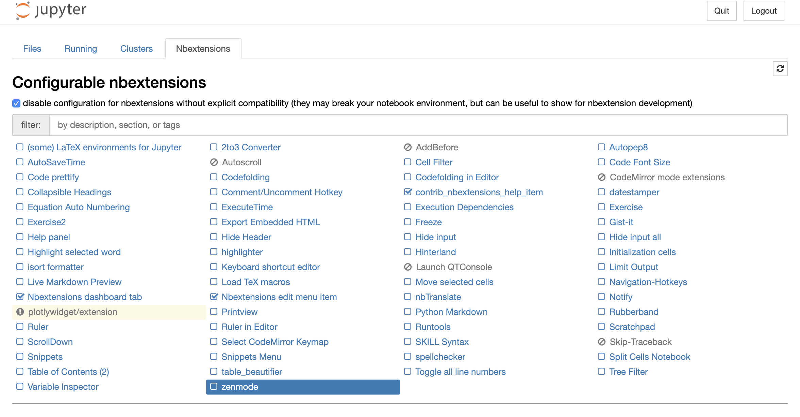
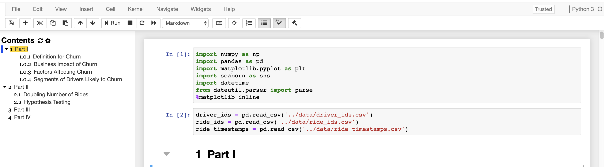
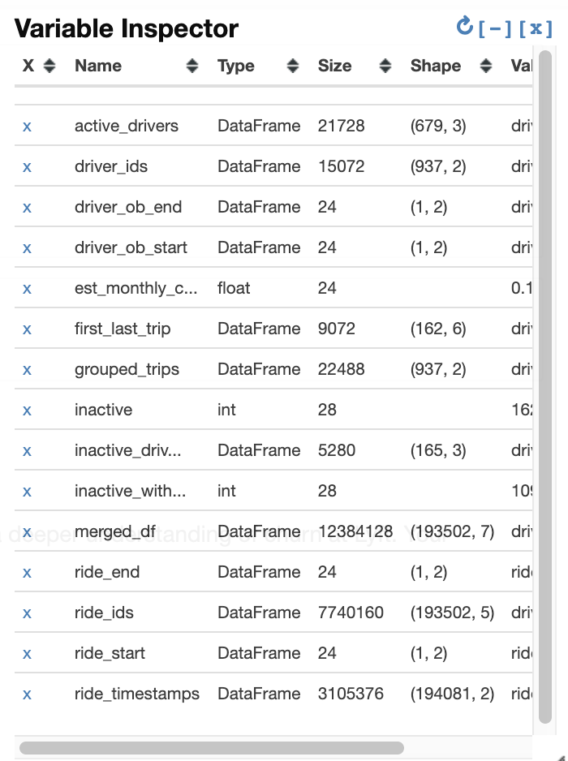

# Useful Extensions (Optional)

There are also a number of extensions that add functionality to the Jupyter Notebook. This section is totally
**optional** but I've found some of the extensions to be quite useful. Essentially, extensions are add-ons to extend
the functionality of Jupyter Notebooks.

If you use Anaconda, you can get started by running in the Terminal:
```
conda install -c conda-forge jupyter_contrib_nbextensions
```

If you use pip, you can run the Terminal:
```
pip install jupyter_contrib_nbextensions && jupyter contrib nbextension install 
```

If you have Jupyter currently running, you will need to restart it by pressing `CTRL+C` and then `Y` to confirm to
shut the server down. Now, upon reentering the Jupyter Notebook interface, you will see a new tab called **Nbextensions**
on the top. Upon clicking into it, you will see a list of configurable extensions which you can select to use.



You can play around with adding and removing extensions to find out what works for you and what doesn't. If you're not
sure what some extension does, you can see documentation for them [here](https://jupyter-contrib-nbextensions.readthedocs.io/en/latest/).

## Table of Contents
One of my favorites are **Table of Contents** which allow you to navigate through your notebook faster and organize
your exploratory process better.



## Variable Inspector
Another useful one I've found is the **Variable Inspector** which is an extension that keeps track of your variables.
If you've used the statistical language R, you may take this for granted. In Jupyter, something like this doesn't
come out of the box.



> Besides that, I simply recommend spending some time figuring out which extensions are useful to you and can improve
your productivity. While none of these are life-changing, the time they save you adds up and can be worthwhile.

