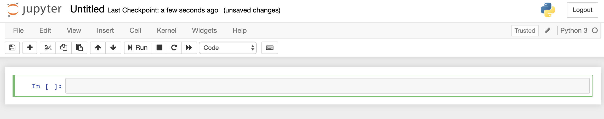
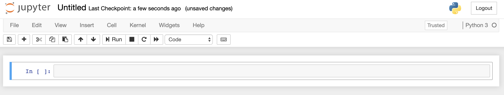

# Common Shortcuts

Before we start coding, I would like to share a few common Jupyter Notebook shortcuts that make navigating and editing
code so much easier. These are all pretty basic and there are other more advanced shortcuts that I'll link to
at the end.

## Navigating and Editing

There are two modes in Jupyter: **edit mode** and **command mode**. You can enter **edit mode** by pressing the
`ENTER` key and switch back to **command mode** by pressing the `ESC` key.

In **edit mode** you can type input into the selected cell while in **command mode** you are able to navigate between
cells with the up/down arrow keys.

- **Edit Mode** is indicated by a *green* left margin.

- **Command Mode** is indicated by a *blue* left margin.

## Command Mode Shortcuts

While in **command mode**,

- `B` Insert Cell Below

- `A` Insert Cell Above

- `D + D` (Press `D` Twice) Delete Selected Cell

- `Z` Undo Cell Deletion

- `S` Save and Make Checkpoint

- `C` Copy Selected Cell

- `X` Cut Selected Cell

- `V` Paste Selected Cell Below

- `Y` Change the Cell Type to Code

- `M` Change the Cell Type to *Markdown* (markup language)

If you are not familiar with *Markdown*, you can think of it of a syntax to add formatting elements to text.
You can find a quick cheatsheet for it [here](https://www.markdownguide.org/cheat-sheet/).

## Edit Mode Shortcuts

**Note:** Windows user will have to replace `CMD` with the `Ctrl` key in the following shortcuts.

While in **edit mode**,

- `Shift + Enter` Run the Cell

- `I + I` (Press `I` Twice) To Interrupt

- `Ctrl + C` Useful for running same cell multiple times

- `Tab` Code Completion or Indent

- `Shift + Tab` Shows Documentation for object you typed in

- `CMD + Z` Undo

- `CMD + Shift + Z` Redo

## Good Resources

- https://www.dataquest.io/blog/jupyter-notebook-tips-tricks-shortcuts/

- https://towardsdatascience.com/jypyter-notebook-shortcuts-bf0101a98330

- Google