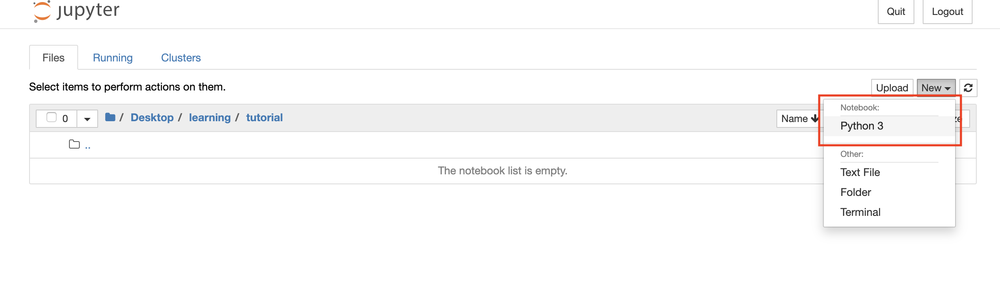

# Introduction to Jupyter

For all of this book, we will be working in Jupyter Notebooks, which is a web application that allows you to create and share documents that contain live code, equations, visualizations, and explanatory text. I like to think of Jupyter Notebooks as the perfect medium for doing and sharing exploratory data analysis work. To me,  Notebooks are the ideal sandbox for playing around with new ideas and tools.

## Creating Your First Jupyter Notebook

Depending on how you installed Jupyter, there are several ways to open up a Jupyter Notebook. One of them is through the **Anaconda Navigator** if you installed through Anaconda.

Simply open the Anaconda Navigator and launch the Notebook from there.


You can also open up the **Terminal** and run the command

```bash
jupyter notebook
```

You would now want to navigate to \(or create\)  some folder where you would like to create your Notebook in.



You can create a Notebook from the right dropdown by selecting Python 3.

## An Alternative to Jupyter Notebooks \(Not Required\) <a id="an-alternative-to-jupyter-notebooks-not-required"></a>

The Jupyter team recently \(2018\) created a newer user interface that offers all the familiar building blocks of the classic Jupyter Notebook \(notebook, terminal, text editor, file browser, rich outputs, etc.\) in a more flexible and powerful interface. The project is called **JupyterLab** and essentially provides everything Jupyter Notebooks has but better \(my opinion\).

> I think CIS 105 is currently taught using Jupyter Notebooks so using JupyterLab is totally not necessary, but good to know that this exists.

You can get JupyterLab [here](https://github.com/jupyterlab/jupyterlab).‌


If you use Anaconda, you can install it with `conda`. Simply open Terminal and run

```bash
conda install -c conda-forge jupyterlab
```

If you use pip, you can run

```bash
pip install jupyterlab
```


To open up JupyterLab, you similarly need to run

```bash
jupyter lab
```

